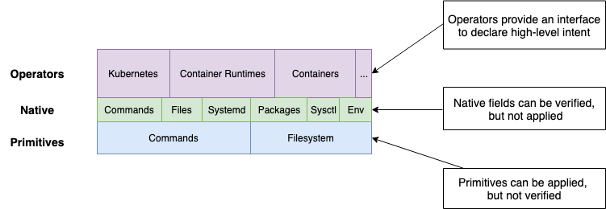

# Design Principles

`konfigadm` differs from tools like ansible, puppet and chef in that it uses a Virtual Filesystem and Shell (VFS), configuration items don't actually make changes, they only update the VFS, changes to the system are only made from the VFS in the final step.

The declarative model (VFS) has a number of advantages over imperative tools where changes are parsed and applied in the same step:

* Unit testing across multiple different configurations becomes trivial
* The VFS can be "compliled" into cloud-init, or inspected to verify state after application
* "Operators" can easily be built that emit other configuration items, these are easily unit and integration testable

`konfigadm` differs to CFEngine in that it does not have any control flows (explicit or implicit) and the "model" only includes 2 low-level items, shell commands and files.

## Goals

* Avoid entire classes of common problems in configuration management by reducing the feature-set
* Simple mental model, that is easy to learn and test against by leveraging declarative configuration following the kubernetes model
* Batteries included for kubernetes environments
* Usable within tools as a go module or standalone as a CLI
* Support the notion of different environments (OS, Cloud) natively without the need for control flow

## Non-Goals

* Be a generic replacement for ansible / cloud-init
* Remote execution (The output of konfigadm can be fed into a remote execution engine)
* Control flow (If/when, loops, etc)

### Common Problems with ansible/puppet/chef

* Trying to install ansible, but requiring a specific version of python
* Installing python, but then requiring a specific version of a pip module in order to execute a  specific task
* Having a playbook work today, but break tomorrow because ansible or python modules have been upgraded / downgraded
* Running an ansible task and it reports a failure or success incorrectly, but you can't work out why, or how to reproduce it outside of ansible
* Trying to support different operating systems, but then having to maintain separate playbooks
* Calling the wrong playbook, because the when expression is wrong / error prone
* Adding a conditional flow to a task, but specifying an incorrect / invalid condition
* Attempting to call sub tasks / roles, but then having different variables reported from the sub-task

Many of these issues could be mitigated by unit testing, however ansible is fundamentally not unit-testable, modules almost exclusively update  global state (by installing packages, updating files or running commands) and there is no way of checking what a module has done or wants todo. The dry-run capability is not universally supported and is self-reported.

Integration testing with tools like molecule is possible, but cannot verify that no other changes were made.

### Common Problems with cloud-init

* Trying to template out a cloud-init YAML file but then getting indentation wrong
* Getting YAML indentation right, but then specifying a field in the wrong section
* Attempting to use a field, but not having the requisite packages installed for it to work
* Trying to support multiple environments within a single or group of YAML files

