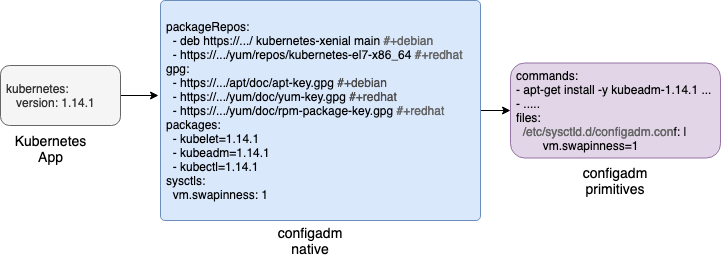

[](https://travis-ci.org/moshloop/configadm)
[](https://codecov.io/gh/moshloop/configadm)
[](https://goreportcard.com/report/github.com/moshloop/configadm)

# configadm

configadm is a node instance configuration tool focused on bootstrapping nodes for container based environments

## Usage

```
Usage:
  configadm [command]

Available Commands:
  apply       Apply the configuration to the local machine
  cloud-init  Exports the configuration in cloud-init format
  help        Help about any command
  minify      Resolve all lookups and dependencies and export a single config file
  verify      Verify that the configuration has been applied correctly and is in a healthy state
  version     Print the version of configadm

Flags:
  -c, --config strings   Config files in YAML or JSON format
  -d, --detect           Detect tags to use
  -h, --help             help for configadm
  -v, --loglevel count   Increase logging level
  -t, --tag strings      Runtime tags to use, valid tags:  debian,ubuntu,redhat,rhel,centos,aws,vmware
  -e, --var strings      Extra Variables to in key=value format
```

## Design


### Mental Models

`configadm` intentionally reuses mental models and concepts from kubernetes, golang and ansible these include:

* Kubernetes declarative model for specifying intent
* Operators for providing higher-order abstractions
* Go build tags in comments for specifying behavior based on OS, Cloud etc..
* Ansible's way of defining variables and allowing for merging of multiple variable files.


### Apps

Apps provide an abstraction over low-level native and primitive elements, They describe high-level intent for using an application that may require multiple elements to configure.

*e.g. kubernetes app spec*
```yaml
kubernetes:
  version: 1.14.1
```

### Native
*e.g. native elements produced by the above kubernetes app*
```yaml
packageRepos:
 - deb https://apt.kubernetes.io/ kubernetes-xenial main #+debian
 - https://packages.cloud.google.com/yum/repos/kubernetes-el7-x86_64 #+redhat
gpg:
 - https://packages.cloud.google.com/apt/doc/apt-key.gpg #+debian
 - https://packages.cloud.google.com/yum/doc/yum-key.gpg #+redhat
 - https://packages.cloud.google.com/yum/doc/rpm-package-key.gpg #+redhat
packages:
 - kubelet=1.14.1
 - kubeadm=1.14.1
 - kubectl=1.14.1
sysctls:
 vm.swapinness: 1
```

Native elements are verifiable, i.e. if you specify a container runtime then `configadm` will verify that the runtime has a service enabled and started and that `root` can connect to the daemon and list running containers.

### Primitives
Primitives are the low-level commands and files that are need to implement native items.

For example a `package: [curl]` native element would create a `apt-get install -y curl` primitive command on debian systems and `yum install -y curl` on redhat systems

The relationship between the 3 kinds is similar to Deployment, ReplicaSet and Pod. Apps insert and/or update native elements, native elements are then “compiled” down to primitives.

### Example chain for kubernetes



### Merge Behavior / Composability

Specs can be combined and merged together - e.g. a cloud provider may install PV drivers and a cluster operator may install organization specific motd/issue files.

1. Configuration from files specified later in the chain overwrite previous configurations. (Similar to the ansible [variable precedence](https://docs.ansible.com/ansible/latest/user_guide/playbooks_variables.html#variable-precedence-where-should-i-put-a-variable) rules)
1. **Lists**  are appended to the end of the existing lists (Unsupported in ansible)
1. **Maps** are merged with existing maps (e.g. [hash_behaviour = merge](https://docs.ansible.com/ansible/2.4/intro_configuration.html#hash-behaviour) in ansible)


## Apps

### Kubernetes

Specifying kubernetes will do everything required to setup a node as a kubernetes worker or master:
* Install and mark the specific versions of `kubeadm`, `kubelet`, `kubectl`
* Install a container runtime if not specified
* Prepull images required to run kubernetes
* Set any sysctl values that are required

```yaml
kubernetes:
  version: 1.14.1
```

## Primitives

`configadm` using a chain of phases. phases earlier in the chain can update items later in the chain. e.g. The `CRI` and `Kubernetes` phases can add packages to be installed in the `packages` phase.

### Environment
Environment variables are saved to `/etc/environment/` and are sourced before any commands runs.
```yaml
environment:
  env1: "val: {{env1}}"
```

### Systctl
```yaml
sysctls:
  net.ipv6.conf.all.disable_ipv6: 1
  net.ipv6.conf.default.disable_ipv6: 1
```

### Container Runtime (CRI)

```yaml
cri:
 version: 18.6.0
 type: docker
 config:
   log-driver: json-file
   log-opts:
     max-size: 1000m
     max-file": 3
```

### Containers
```yaml
containers:
  - image: "docker.io/consul:1.3.1"
    args: agent -ui -bootstrap -server
    docker_args: --net=host --dns={{private_dns}}
    env:
      CONSUL_CLIENT_INTERFACE: "{{consul_bind_interface}}"
      CONSUL_BIND_INTERFACE: "{{consul_bind_interface}}"
```

### Packages

Packages can include modifiers:
* `-` - Package should be removed if installed
* `+` - Package should be update to the latest
* `=` - Package should me marked to prevent future automatic updates

```yaml
packages:
  - socat
  - -docker-common
  - -docker
  - =docker-ce==18.06
```

Packages can also leverage runtime flags:

```yaml
packages:
  - netcat #+debian
  - nmap-ncat #+redhat
  - open-vm-tools #+vmware
  - aws-cli #+aws
  - azure-cli #+azure
```

### Services

### Commands

Commands are executed at 3 specific points:

`pre_commands`
Pre-commands are used to prepare the environment for execution, OS detection and setting of runtime flags is done in this phase so that they can be used in all other phases. e.g. set an environment variable based on the output of a command.

`commands`
Phases can only append to this Commands list.

`pre_commands`
Post commands run after all the phases have completed and can be used for cleanup functions are for handing off to other systems.

## Natives


## Runtime Tags

```bash
configadm minify -c config.yml --tags ubuntu
# tags are detected by default when using the apply command
configadm apply -c config
```

Similar to go build tags, runtime tags provide a way of deciding what gets run, the following tags are provided by default:


* `centos`
* `ubuntu`
* `fedora`
* `debian` matched for all debian based distros (ubuntu)
* `rhel`
* `redhat` matched for all redhat based distros (centos, fedora, rhel, amazon linux)
* `amazonLinux`
* `aws` matched when running inside Amazon Web Services
* `azure` matched when running inside Azure
* `vmware` matched when running on a vSphere Hypervisor
* `kvm` matched when running on a KVM Hypervisor

Tags can be applied to the following elements:
* packages
* packageRepos
* packageKeys
* commands, pre_commands, post_commands

Multiple tags can be specified in which case all tags must match.
```yaml
packages:
  # only install aws-cli on debian based system running in AWS
  - aws-cli #+debian +aws
```

Tags can be negated using `!`

```yaml
pre_commands:
  # attach a rhel subscription, but only if we are not running in AWS
  - subscription manager attach #+rhel !aws
```

## Contributing

Make sure both unit and integration tests pass:

```bash
make
```

You can run unit tests only via:

```bash
make test
```

And only integration tests via:

```bash
make integration
```

## Design

See [Design Principles](./DESIGN.md)
