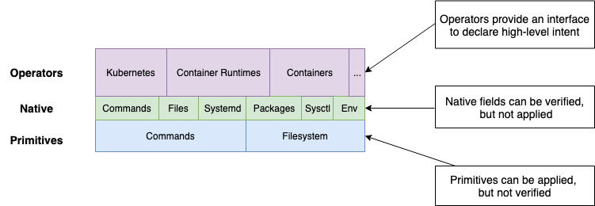

<p align="center">
<a href="https://circleci.com/gh/moshloop/konfigadm"></a>
<a href="https://codecov.io/gh/moshloop/konfigadm"></a>
<a href="https://goreportcard.com/report/github.com/moshloop/konfigadm"></a>
</a>
</p>

<p align="center">
  <a href="#installation">Installation</a> •
  <a href="#installing-kubernetes">Kubernetes</a> •
  <a href="#features">Key Features</a> •
  <a href="#compatibility">Compatibility</a> •
  <a href="https://www.moshloop.com/konfigadm"> Full Documentation </a>
</p>

<script src="https://asciinema.org/a/250079.js" id="asciicast-250079" async></script>

konfigadm is a declarative configuration management tool focused on bootstrapping nodes for container based environments.

`konfigadm` differs from tools like ansible, puppet and chef in that it uses a Virtual Filesystem and Shell (VFS), configuration items don't actually make changes, they only update the VFS, changes to the system are only made from the VFS in the final step.

The declarative model (VFS) has a number of advantages over imperative tools where changes are parsed and applied in the same step:

* Unit testing across multiple different configurations becomes trivial
* The VFS can be "compliled" into cloud-init, or inspected to verify state after application
* "Operators" can easily be built that emit other configuration items, these are easily unit and integration testable

`konfigadm` differs to CFEngine in that it does not have any control flows (explicit or implicit) and the "model" only includes 2 low-level items, shell commands and files.

## Installation

### Ubuntu / Debian

```bash
wget https://github.com/moshloop/konfigadm/releases/download/0.2.0/konfigadm.deb
dpkg -i konfigadm.deb
```

### Centos / Fedora / Redhat

```bash
rpm -i https://github.com/moshloop/konfigadm/releases/download/0.2.0/konfigadm.rpm
```

### Binary

```bash
wget -O /usr/bin/konfigadm https://github.com/moshloop/konfigadm/releases/download/0.2.0/konfigadm && chmod +x /usr/bin/konfigadm
```

## Getting Started

### Installing Kubernetes

```bash
konfigadm apply -c - <<-EOF
kubernetes:
  version: 1.14.2
container_runtime:
  type: docker
commands:
  - kubeadm init
EOF
```

## Compatibility

Compatibility is tested via the docker systemd images created by [jrei](https://github.com/j8r/dockerfiles/tree/master/systemd), All example fixtures are first verified as false, applied, and then verified as true.

To run integration tests:

```bash
make ubuntu
```

**Compatibility Matrix**

| OS                      | Status                                                       | Tags                       |
| ----------------------- | ------------------------------------------------------------ | -------------------------- |
| Ubuntu 16.04            |  | `#ubuntu debian-like`      |
| Ubuntu 18.04            |  | `#ubuntu debian-like`      |
| Centos 7                |  | `#centos redhat-like`      |
| Debian 9                |  | `#debian debian-like`      |
| Fedora 29               |  | `#fedora `                 |
| Amazon Linux            |  but should work         | `#amazonLinux redhat-like` |
| Redhat Enterprise Linux |  but should work             | `#rhel redhat-like`        |


## Features



konfigadm is a node instance configuration tool focused on bootstrapping nodes for container based environments

* Dependency free and easily embeddable into an image builder.
* Has built-in higher-order abstractions for kubernetes, containers, cri, cni, etc.
* Declarative, The order of operations cannot be changed, there are no implicit or explicit dependencies between items, no conditionals (besides for os/cloud tags) or control flows
* Typed, can validate the configuration (e.g. docker image name is valid, systemd.unit file only includes valid keys, and the values are typed correctly)
* Supports multiple operating systems and package managers.
* Abstractions and many of the built-in elements are easily unit-testable due to the use of virtual filesystem and command execution list.
* Automatic testing / verification based on intent, not just command success code
* Generate cloud-init or shell scripts to be used by other systems

## TODO

* Incremental mode
* Merge duplicate command dependencies (e.g. installing curl)
* Support templating everywhere (currently only supported in files)
*

## Usage

```
Usage:
  konfigadm [command]

Available Commands:
  apply       Apply the configuration to the local machine
  cloud-init  Exports the configuration in cloud-init format
  help        Help about any command
  minify      Resolve all lookups and dependencies and export a single config file
  verify      Verify that the configuration has been applied and is in a healthy state
  version     Print the version of konfigadm

Flags:
  -c, --config strings   Config files in YAML or JSON format
  -d, --detect           Detect tags to use
  -h, --help             help for konfigadm
  -v, --loglevel count   Increase logging level
  -t, --tag strings      Runtime tags to use, valid tags: debian,ubuntu,redhat,rhel,fedora,redhat-like,debian-like,centos,aws,vmware
  -e, --var strings      Extra Variables to in key=value format
```


