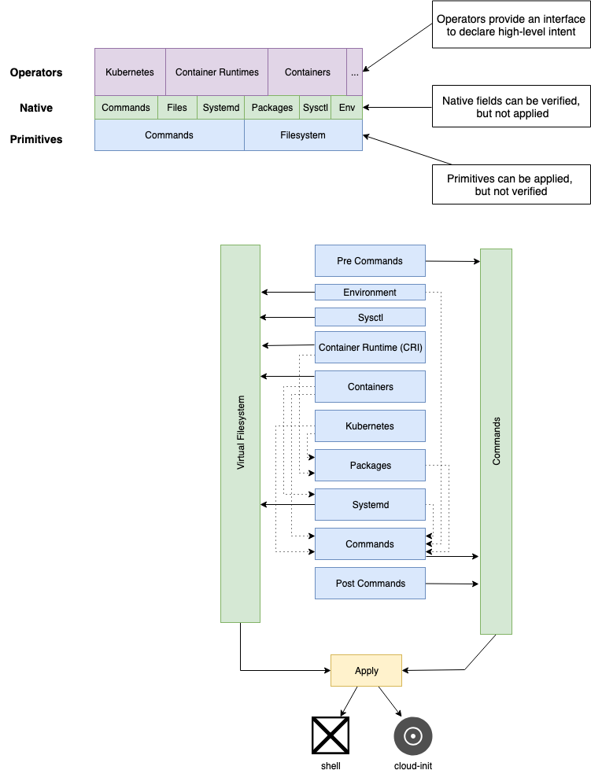

[](https://travis-ci.org/moshloop/configadm)
[](https://codecov.io/gh/moshloop/configadm)
[](https://goreportcard.com/report/github.com/moshloop/configadm)

configadm is a node instance configuration tool focused on bootstrapping nodes for container based environments


# Design


## Phases

`configadm` using a chain of phases. phases earlier in the chain can update items later in the chain. e.g. The `CRI` and `Kubernetes` phases can add packages to be installed in the `packages` phase.

### Environment
Environment variables are saved to `/etc/environment/` and are sourced before any commands runs.
```yaml
environment:
  env1: "val: {{env1}}"
```
### Systctl
```yaml
sysctls:
  net.ipv6.conf.all.disable_ipv6: 1
  net.ipv6.conf.default.disable_ipv6: 1
```
### Container Runtime (CRI)
### Containers
```yaml
containers:
  - image: "docker.io/consul:1.3.1"
    args: agent -ui -bootstrap -server
    docker_args: --net=host --dns={{private_dns}}
    env:
      CONSUL_CLIENT_INTERFACE: "{{consul_bind_interface}}"
      CONSUL_BIND_INTERFACE: "{{consul_bind_interface}}"
```
### Kubernetes
### Packages

Packages can include modifiers:
* `-` - Package should be removed if installed
* `+` - Package should be update to the latest
* `=` - Package should me marked to prevent future automatic updates

```yaml
packages:
  - socat
  - -docker-common
  - -docker
  - =docker-ce==18.06
```

Packages can also leverage runtime flags:

```yaml
packages:
  - netcat #+debian
  - nmap-ncat #+redhat
  - open-vm-tools #+vmware
  - aws-cli #+aws
  - azure-cli #+azure
```

### Systemd
### Commands

## Runtime Flags

Similar to go build flags, runtime flags provide a way of deciding what gets run, the following flags are provided by default:

* `centos`
* `ubuntu`
* `fedora`
* `debian` matched for all debian based distros (ubuntu)
* `rhel`
* `redhat` matched for all redhat based distros (centos, fedora, rhel, amazon linux)
* `amazonLinux`
* `aws` matched when running inside Amazon Web Services
* `azure` matched when running inside Azure
* `vmware` matched when running on a vSphere Hypervisor
* `kvm` matched when running on a KVM Hypervisor

Multiple  flags can be specified in which case all flags must match. Flags can be negated using `!`

For example the Docker CRI is implemented as:

```yaml
pre_commands:
  - subscription manager attach #+rhel !aws
packages:
  - docker-ce #!rhel
  - docker #+rhel
  - device-mapper-persistent-data #+centos
  - lvm2  #+centos
packageKeys:
  - https://download.docker.com/linux/ubuntu/gpg #+ubuntu
packageRepos:
  - https://download.docker.com/linux/centos/docker-ce.repo #+centos
  - https://download.docker.com/linux/fedora/docker-ce.repo #+fedora
  - deb https://download.docker.com/linux/ubuntu {{lsb.codename}} stable #+ubuntu
```


## Virtual Filesystem

Phases do not write directly to the filesystem, only to the virtual filesystem. Phases can also read and update files written by earlier phases.

## Commands

Commands are executed at 3 specific points:

**Pre Commands**
Pre-commands are used to prepare the environment for execution, OS detection and setting of runtime flags is done in this phase so that they can be used in all other phases. e.g. set an environment variable based on the output of a command.

**Commands**
Phases can only append to this Commands list.

**Post Commands**
Post commands run after all the phases have completed and can be used for cleanup functions are for handing off to other systems.

## Apply

One all phases have run the virtual filesystem and command list is used to either create a cloud-init file or ISO. Or applied directly to the system using a shell.

# Design Principles

## Cloud Native

`configadm` has native support for containerized environments and *nothing* else - It is designed to bootstrap immutable container hosts and then handoff to the container(s) and/or orchestrators for everything else.

## Dependency Free

**Runtime Dependencies**
> `configadm` is built in pure Go and distributed as a statically linked binary.

Ansible is a good example of how bad dynamically linked tools can get - The dependencies for core Ansible is relatively easy to solve using a Python virtualenv, the 1000's of modules that makeup the extended ansible platform depend on hundreds of other packages - These dependencies are at best visible in documentation and error messages, there is no way of knowing what dependencies (nevermind the version) that are required for a given playbook.

**Explicit Execution Dependencies**
> `configadm` does not support any control flows (besides for runtime tags), the ordering of actions is well defined and cannot be changed.

Ansible provides explicit ordering using control statements such as loops and conditionals,  this explicit ordering is coupled with implicit variable management with a very complex precedence hierarchy and ruleset. Creating a mental model of what a given variable will be is almost impossible. Unit testing this state is impossible.

**Implicit Execution Dependencies**
Unlike Ansible, CFEngine and Terraform do not have explicit ordering, Some might argue that they don't have ordering altogether - However the use of input variables and classes create implicit ordering with a complex runtime state machine - It is almost impossible to create and execute this state machine mentally making it very difficult to troubleshoot and test.

## Stateless
> `configadm` uses a virtual filesystem and command set for all higher order functions - this makes it trivial to compose and unit-test features.

While the execution model of Ansible does not have persistent state, it is state driven. Facts discovered at runtime can alter behavior, when used across a cluster of machine the impact of state becomes even more important with intermittent connection issues to cluster members potentially creating conflicting state between runs.
The use of change tracking also makes it impossible to ascertain whether a given step will execute.

Ansible, CFEngine and Terraform all execute on the underlying components directly, making only integration testing possible (and difficult)


